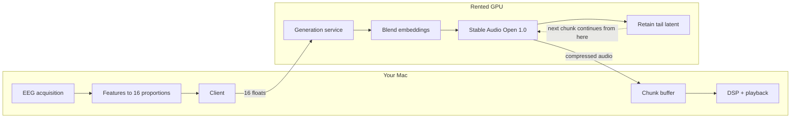

# Brain State to Music

Read EEG, turn it into music that is generated fresh for whatever state you are in. Nothing pre-recorded, nothing retrieved, no library of clips. Every batch of audio is made on the spot and has never existed before.

---

## What actually happens, on the clock

**Once at startup:** encode the 16 prompts. No audio. These 16 prompts must be distinct and comprehensive enough to form a rich space of possibilities of all human emotions.

**Then, continuously, every 16 seconds:**

1. Read your current brain state — this instant, live.
2. Turn it into 16 proportions.
3. Blend the 16 precomputed embeddings by those proportions. Out comes one new embedding representing exactly your state right now.
4. Send it to the GPU. The random seed stays **fixed for the whole session**, so your brain is the only thing changing.
5. The diffusion model generates 16 seconds of audio that has never existed, continuing from the tail of the previous chunk.
6. It arrives and plays.

**And between those, continuously at audio rate:** filter, reverb, and level follow your live state, so the sound is being shaped moment to moment even within a chunk.

---


## Precomputed vs. not

The word "precomputed" caused confusion, so to be exact:

- The 16 prompt **texts** — written by you, once.
- The 16 text **embeddings** — computed at startup, about a second, produce no sound. These are ingredients.
- The **proportions** — live from your brain, four times a second.
- The **blended embedding** — computed fresh for every chunk.
- The **audio** — generated fresh every chunk, never repeats, never stored and replayed.

Embeddings do not play. Audio plays. The embeddings are only how the 16 prompts get represented so they can be mixed.

---


## The 16 prompts

Sixteen emotional territories, four in each quadrant of the valence-arousal circumplex — the standard psychological model of affect, where every emotion is a point in a space of pleasantness and activation.

```
                    HIGH AROUSAL
                          |
    13 anxiety            |            1 euphoria
    14 dread              |            2 triumph
    15 anger              |            3 playful joy
    16 tension            |            4 awe
                          |
  NEGATIVE ---------------+--------------- POSITIVE
                          |
    9  melancholy         |            5 serenity
    10 grief              |            6 tenderness
    11 emptiness          |            7 contentment
    12 nostalgia          |            8 reverie
                          |
                     LOW AROUSAL
```


### High arousal, positive

```
1.  "soaring euphoric synth arpeggios, shimmering bright pads, four-on-the-floor kick,
     rising ecstatic energy, C major, 120 BPM"

2.  "bold brass-like synth stabs, powerful driving drums, confident marching pulse,
     victorious and heroic, C major, 120 BPM"

3.  "bouncy plucked synths, light staccato marimba, skipping syncopated rhythm,
     cheerful and mischievous, C major, 120 BPM"

4.  "vast slow-swelling choral pads, distant shimmering bells, wide suspended chords,
     immense open space, breathtaking and sublime, C major, 120 BPM"
```


### Low arousal, positive

```
5.  "gentle sustained warm pad, soft sine tones, no percussion, slow breathing swells,
     deeply peaceful and still, C major, 120 BPM half-time"

6.  "intimate felt piano, soft analog warmth, close and delicate, small gentle gestures,
     loving and tender, C major, 120 BPM half-time"

7.  "mellow rhodes chords, soft brushed drums, easy relaxed groove, unhurried and safe,
     quietly content, C major, 120 BPM"

8.  "blurred reversed pads, tape-saturated haze, weightless drifting texture,
     dreamlike and floating, C major, 120 BPM half-time"
```


### Low arousal, negative

```
9.  "sparse minor piano, faint distant string swells, slow and restrained,
     quietly sad and withdrawn, A minor, 120 BPM half-time"

10. "deep mournful cello drone, hollow low piano notes, heavy and slow,
     desolate and aching, A minor, 120 BPM half-time"

11. "thin cold sine drone, long dead silences between notes, no warmth or movement,
     numb and hollow, A minor, 120 BPM half-time"

12. "distant detuned music box, worn tape wobble, faded and far away,
     bittersweet longing for something lost, A minor, 120 BPM half-time"
```


### High arousal, negative

```
13. "restless ticking pulses, nervous tremolo strings, unstable jittering rhythm,
     uneasy and agitated, A minor, 120 BPM"

14. "low rumbling sub bass, creeping dissonant swells, slow inescapable approach,
     ominous and dreadful, A minor, 120 BPM"

15. "harsh distorted bass, aggressive pounding industrial drums, relentless and violent,
     furious, A minor, 120 BPM"

16. "sustained high dissonant strings, sharp irregular percussive hits, coiled and unresolved,
     suspenseful anticipation, A minor, 120 BPM"
```


### Why these keys

Eight prompts in C major, eight in A minor. Those are **relative keys — they contain exactly the same seven notes.** So the split tracks valence (bright versus dark) while guaranteeing that any blend of any prompts remains harmonically compatible. Mixing a C major pad with an A minor piano produces modal ambiguity that reads as intentional rather than wrong.

This matters because valence is the least reliable thing EEG gives you. The proportions will wander across the major/minor boundary on noise alone, and the key choice makes that wandering sound like expression instead of error.

### Why one tempo

All sixteen are 120 BPM so chunks always align rhythmically. Energy differences are carried by **note density and subdivision**, not tempo — the low-arousal prompts say "half-time," which is a feel at the same underlying pulse, exactly how real music handles this. Everything stays beat-compatible.

### Coverage beyond the basic four quadrants

The circumplex alone would give you happy, calm, sad, and angry. The four-per-quadrant expansion picks up emotions it flattens: **awe** (4) is high-arousal positive but vast rather than excited, **nostalgia** (12) is genuinely mixed-valence rather than simply sad, **emptiness** (11) is absence rather than sadness, and **tension** (16) is anticipation without a defined threat.

Your brain produces 16 numbers that sum to 1 — how much of each prompt to use. A calm, settled state might be 45% serenity, 30% contentment, 15% tenderness, 10% reverie. As your state drifts, the proportions slide, and the music slides with them.

Blending is a weighted average of the embeddings:

```python
blended = sum(w[i] * anchor_embeds[i] for i in range(16))
```

Because the weights sum to 1, the result always lands inside the region spanned by the 16 prompts, which is a region the model knows how to render.

---


## Why nothing repeats

Two independent reasons:

1. The proportions are continuous numbers. Landing on the exact same 16 values twice essentially never happens.
2. Each chunk continues from the tail of the previous one, so its starting point is never the same twice either.

There is no lookup, no library, no matching, no retrieval. The system has no stored audio to fall back on.

---


## The seed stays fixed

One random seed per session, logged in the session record. Not a fresh one per chunk.

**The seed is a confound.** Generate the same prompt twice with different seeds and you get two completely different pieces of music — different melodies, different instruments, different everything. Nudge the embedding instead and you get a subtle shift in character. The seed's effect is far larger than the brain's.

So if both move at once, the seed is all you perceive. The brain coupling would still be there mathematically and be completely invisible experientially — a random music generator with a brain-shaped decoration on it. The null test would correctly report nothing.

Fixing the seed is the same move as holding every variable constant except the one you are studying. Your brain becomes the only thing changing, so it becomes the only thing you hear changing.

**It also buys continuity.** With a fixed seed, the map from embedding to audio is roughly continuous: a small change in state produces a small change in the music, and a gradual drift produces a gradual morph. Reseeding every chunk destroys that — each chunk becomes an independent sample, cutting to something unrelated every 16 seconds no matter what you did. Smooth response to gradual change is most of the experience, and it only exists with a fixed seed.

**And it makes replay real.** Fixed seed plus logged brain state means a session can be regenerated exactly, which is what lets you A/B a change to the prompts or the mapping against identical brain data.

This does **not** conflict with generating unique audio. Output depends on seed, embedding, and the continuation from the previous chunk; the latter two change constantly. The only way to hear the same thing twice would be a genuinely identical brain state with no continuation, which does not occur — and if it did, hearing something very similar is the instrument being faithful, not broken.

**Fixed absolutely during the null test**, or the test measures nothing.

*If long sessions feel too static:* interpolate slowly between two fixed noise tensors over several minutes rather than resampling per chunk. Long-arc variety, short-term changes still attributable to your brain. Only add this after confirming the coupling works, since it reintroduces the confound we just removed.

---


## The lag

The chunk playing right now was generated from your brain roughly 16 to 30 seconds ago — generation takes a few seconds, and it had to wait for the previous chunk to finish playing.

This is accepted. It is the shape of the model, not a bug.

The DSP layer is what makes the system feel responsive anyway: filter, reverb, and level react within milliseconds, so the shape of the sound tracks you continuously while the underlying material catches up.

---


## Where things run

EEG has to be read where your head is and audio has to play where your ears are. Only generation moves to the GPU.




Upstream traffic is **16 floats**. Raw EEG never leaves your machine.

The server is session-stateful: it holds the previous chunk's tail latent so each new chunk can continue musically from the last one without uploading audio.

Persistent pod, started at session start and killed at the end. A cold start on a 1B model takes over a minute and would stall the loop.

---


## From scalp to proportions

1. **Acquire.** BrainFlow, 250 Hz, 8 EEG channels into a ring buffer. Dedicated thread that does nothing else.
2. **Clean.** Bandpass 1-45 Hz, notch 60 Hz, re-reference. Reject windows over 150 uV or with sample jumps over 50 uV. On a bad window hold the last state and drop confidence rather than substituting zeros.
3. **Features.** Every 250 ms take the last 4 seconds, Welch PSD per channel, integrate over delta/theta/alpha/beta/gamma, take logs. Add beta/alpha and theta/alpha ratios and total power. Result: a 64-dimensional vector.
4. **Calibrate.** Once per session, 30 s eyes open and 30 s eyes closed. Compute per-dimension mean and standard deviation. Everything afterward is z-scored against this, because raw band powers depend on impedance and hair and mean nothing on their own.
5. **Project.** `w = softmax(W @ features / temperature)` gives the 16 proportions. Slew-limit so they cannot move faster than about 0.15 per second — brains are noisy, music should not twitch.

Cold start is free: the 60-second calibration gives the GPU time to generate the first chunks, so the buffer is full by the time calibration ends.

---


## Playback

- 44.1 kHz stereo, blocksize 512.
- Two chunk players, equal-power crossfade at the seam.
- DSP driven by a live parameter snapshot: state-variable filter cutoff from brightness, reverb send from space, gain from energy.
- Every parameter one-pole smoothed, about 150 ms, or you get zipper noise.
- **Callback rules, absolute:** no locks, no allocation, no logging, no network, no torch. It reads one atomically-swapped parameter struct and pre-loaded arrays.
- If the next chunk is late, keep looping the current one until it arrives. Never reach for stored audio.

---


## Parameters

```
EEG           250 Hz, 8 channels
Filtering     bandpass 1-45 Hz, notch 60 Hz
Bands         delta 1-4, theta 4-8, alpha 8-13, beta 13-30, gamma 30-45
Windows       4.0 s analysis, 0.25 s hop
Features      64 dims, z-scored against session calibration
Prompts       16, fixed key and BPM
Audio         44.1 kHz stereo, blocksize 512
Chunks        8 bars at 120 BPM = 16.0 s
Buffer        2 chunks ahead
Smoothing     DSP one-pole 150 ms; proportions slew 0.15/s
Seed          one per session, fixed, logged
```

---


## Build order

Never debug two unknown subsystems at once. The EEG path gets verified without audio, the audio path without EEG, and only then do they meet.

1. **Scaffold.** uv project on Python 3.11, config, data types, state bus.
2. **EEG path plus live monitor.** No audio at all. Watch the 64-dim vector and the 16 proportions move on synthetic data. Close your eyes and confirm alpha rises.
3. **Generation, standalone.** Get Stable Audio Open 1.0 running on a rented GPU. Verify blended embeddings produce sensible audio by generating along a path between two prompts and listening. Measure generation time.
4. **Audio engine, hand-driven.** Chunk buffer, crossfade, DSP, playback — with proportions controlled by keyboard, brain entirely out of the picture. This is where dropouts and seams get found.
5. **Close the loop.** Wire brain proportions into the generation requests. Small step, since everything else already works.
6. **Verify.** Logging, then the null test.

A **stub backend** that returns pre-made audio instantly exists from step 1 so the whole system can be built and tested without a GPU running. It stays permanently as the offline development path.

---


## Verification

This is the part that separates an instrument from a pleasant random number generator.

**Positive control.** Close your eyes. Alpha spikes, the proportions move measurably, the music audibly changes. If this does not happen, stop and debug upstream — nothing downstream can work.

**Null test.** Run blocks that secretly alternate real brain state against time-shuffled state from earlier in the session. Same statistics, no temporal correspondence. After each block, log whether it felt responsive. Analyze with a binomial test against chance.

If you cannot beat chance, the coupling is not real and no amount of polish fixes it.

**Logging.** Everything timestamped and replayable: raw EEG, filtered signal, features, proportions, requests, chunks, DSP parameters, and the rendered audio. This is also the paired EEG+audio dataset a learned encoder would need later — nearly free now, miserable to retrofit.

---


## Open questions, resolved by measurement

- **Generation time** for 16 s of audio on the chosen GPU. Determines buffer depth and whether 8-bar chunks are the right size.
- **Does embedding interpolation work?** Generate at 0%, 25%, 50%, 75%, 100% between two prompts and listen. If midpoints are musically sensible, blending works as designed. If they are mush, prompts need to be chosen closer together or blending moves to the audio level.
- **Do the 16 prompts actually render as distinct?** Generate each one and listen. Any two that sound alike are wasting a dimension and should be pushed further apart. Any that sound bad in isolation will sound worse in a blend. Expect to revise the wording repeatedly — this is the single biggest lever on how the system sounds, and it is pure taste.
- **Does the model respect key and tempo instructions?** Stable Audio Open was trained largely on Freesound and FMA, whose metadata is thin on music theory, so "C major, 120 BPM" may be partly ignored. If so, the descriptive adjectives are carrying the emotional weight and harmonic compatibility becomes approximate. Worth checking early, since it determines whether chunks genuinely align or merely sit near each other.
- **Modal refinement.** If the model does respond to theory terms, the seven modes of the C major scale (Lydian for awe, Phrygian for dread, Dorian for nostalgia) give finer emotional color while still using only the same seven notes. Test before adopting.

---


## Honest expectations

Arousal from the beta/alpha ratio is reasonably robust. Valence from frontal alpha asymmetry is weakly supported and will be noisy — it gets computed and logged, but the null test decides whether it earns a role in the mapping.

EEG carries only a few bits per second you can trust. The design does not fight that; it picks an output that only needs a few bits of steering.

---


## Later

The mapping from brain to proportions is a swappable box. v1 uses band powers and a projection matrix. v2 replaces it with a learned encoder trained on the paired EEG+audio data this system records, which uses cross-channel structure and temporal dynamics that five band powers throw away.

The usual objection — that a listening-trained encoder collapses on resting EEG — does not apply here, because in a closed loop music is always playing, so the encoder stays permanently in-distribution.


### Explanation Script


We use EEG to read from the brain. That signal gets turned into sixteen proportions — numbers that add up to one — where each proportion says how much of one of sixteen emotional prompts is present right now. Those sixteen prompts are written to span the full space of human emotion, and each one has already been encoded into an embedding, so blending them by those proportions gives us a single embedding representing this brain's exact state in this moment.

We hand that embedding to a diffusion model, along with a fixed noise seed and the tail of the audio that's currently playing, and the model turns noise into sixteen seconds of music that has never existed before. Then we do it again. The brain streams in continuously and audio streams out continuously, and because the seed stays fixed for the whole session, the only thing changing the music is the person.

On top of that, a real-time layer shapes filter, reverb, and level directly from the live signal — so the sound responds within milliseconds, even though genuinely new material takes about half a minute to arrive.


One liner?

We read the brain with EEG, turn that into a proportion of sixteen emotional prompts, and feed the blended embedding to a diffusion model that generates music from noise in real time. 